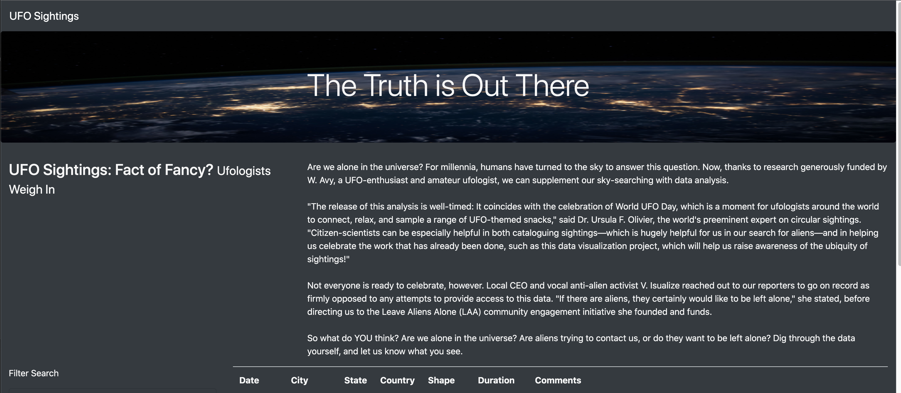
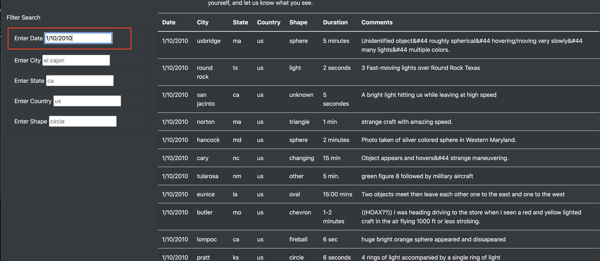
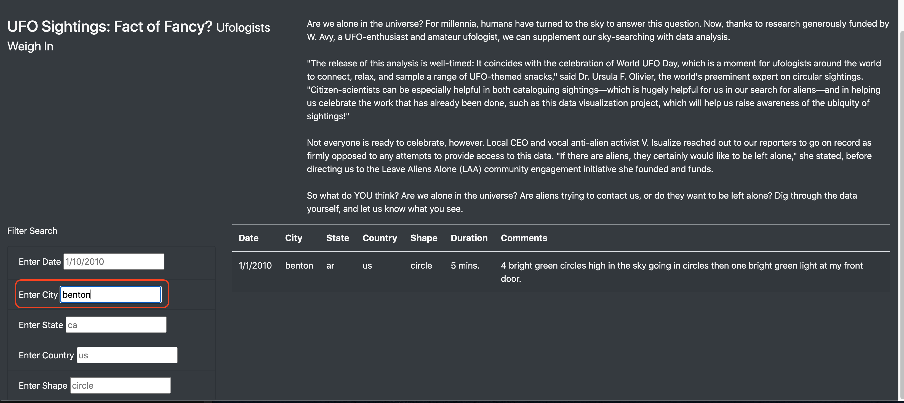
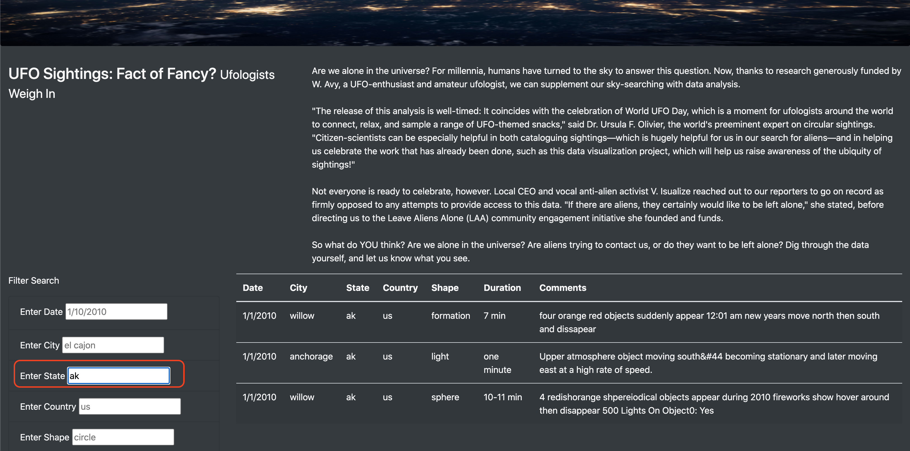
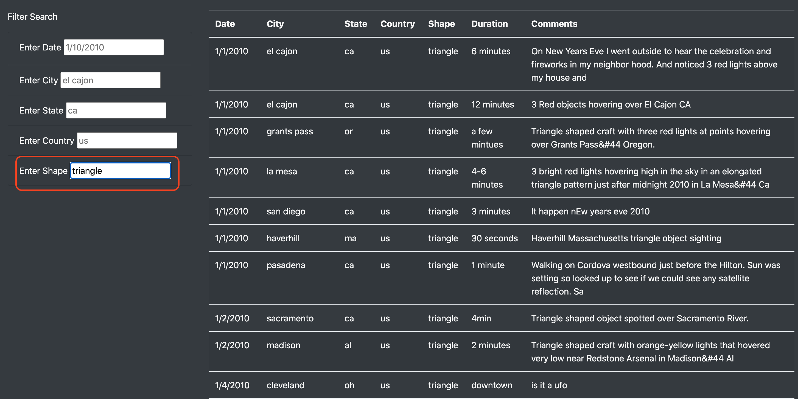

# UFOs

## Project Overview
This project centers around creating a dynamic UFO Finder webpage that allows users to filter 2010 UFO sightings within an incorporated table based on 5 different criteria: Date, City, State, Country and Shape.

## Results
Within our newly created UFO Finder webpage, I have added a table of UFO sightings that have happened across the US.  Because there is so much data, I've added filters to be able to focus in on different types of criteria. The next few images will walk the user through how to utilize these filters to find the data that the user is looking for.  These filters can be used individually or in combination with each other to further narrow down the results.

### Date Filter
The date filter allows users to narrow down the UFO sighting results based on the date of the sighting.  In the screenshot below, I've shown the results of filtering the UFO sighting to 1/10/2010.

### City Filter
The city filter allows the user to identify UFO sightings by the city they occurred.  In the example below, I have filtered down to the city of Benton which returns only 1 result.

### State Filter
The state filter works similary to the city filter, it narrows results based on the state abbreviation. In the example below, I've filtered down to the abbreviation for Alaska which returns 3 UFO sightings.

### Country Filter
The country filter allows users to filter the UFO sightings based on the country. However, since all of our sightings occurred in the US, this filter doesn't add much value to the page and I would not recommend using this filter.

### Shape Filter
The shape filter allows users to filter the sightings based on the shape of the UFO that was identified.  In the example below, I've filtered the page based on the "triangle" shape and given back multiple results.

## Summary
The ability to filter the sightings table gives the user a lot of power in allowing them to focus in on the specific data they are looking for. However, there are some drawbacks and recommendations that come with this page.

1. 1 drawback of this page is there isn't a "clear filters" button to remove the criteria and reset the filters. The user must manually delete each field before starting a new filter.

2. The first recommedation that I would make for this page is to remove the country filter. The table only includes data from across the US, but insinuates to the user that it contains data from multiple countries. Removing this filter should clear up any confusion.

3. The second recommendation I would make is to add dropdown lists to the filters since not every city, state, date, shape is contained within the table.  The user needs to know exactly what they are looking for in the current state, but with dropdown options they are aware of what is available without having any previous knowledge.